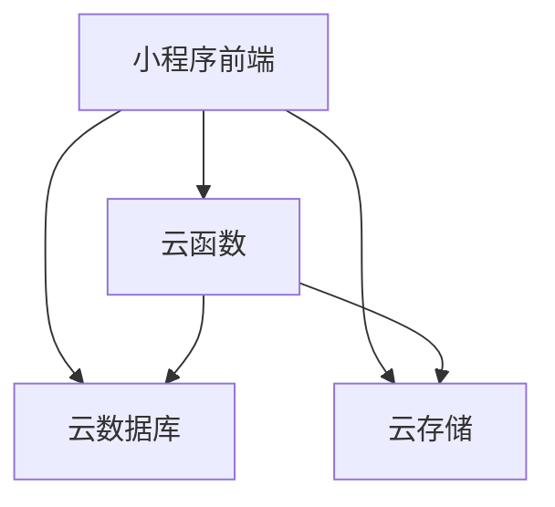
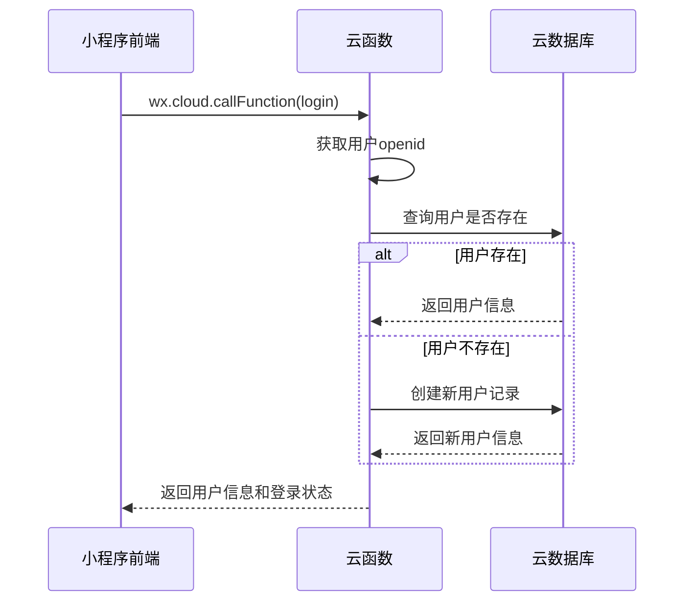

# 母婴打卡小程序开发指南

## 目录

1. [项目概述](#项目概述)
2. [产品需求文档](#产品需求文档)
3. [技术架构](#技术架构)
4. [数据存储方案](#数据存储方案)
5. [UI设计规范](#UI设计规范)
6. [项目结构与框架](#项目结构与框架)
7. [开发流程](#开发流程)
8. [部署与发布](#部署与发布)
9. [维护与更新](#维护与更新)
10. [文档修订历史](#文档修订历史)

## 项目概述

母婴打卡小程序是一款专为妈妈和婴幼儿设计的实用打卡工具，提供简单直观的待办事项管理功能。小程序采用可爱简约、扁平、暖色系的设计风格，帮助家长轻松记录和管理母婴日常生活中的各种重要事项。

**核心功能：**
- 日常事项打卡记录
- 自定义任务创建
- 任务模板推荐
- 历史打卡记录查询
- 响应式界面设计，适配不同设备

**设计特点：**
- 底部两个主要tab：打卡首页、我的
- 直观的待打卡事项展示
- 便捷的一键打卡功能
- 丰富的循环任务设置选项
- 可爱简约、扁平、暖色系的视觉风格
- 云端数据存储，支持功能扩展

## 产品需求文档

### 1. 产品概述

母婴打卡小程序致力于为家长提供便捷的育儿记录工具，帮助家长科学育儿，记录宝宝成长的每一个重要瞬间。

### 2. 功能模块

#### 2.1 用户管理模块
- 微信授权登录
- 用户信息管理（头像、昵称）
- 个人设置

#### 2.2 打卡首页模块
- 待打卡区展示（按日期由近及远排序）
- 循环任务智能展示（仅显示循环期间内最近的一次）
- 一键完成打卡功能
- 左滑编辑/删除功能
- 历史已完成事项展示（按日期由远及近排序）
- 添加打卡事项入口

#### 2.3 事项建议模块
- 推荐事项列表展示
- 自定义事项创建入口
- 事项分类展示

#### 2.4 事项创建/编辑模块
- 事项名称设置（建议事项不可更改名称）
- 副标题设置（可选）
- 循环类型选择（不循环、每天、每周、每月）
- 每周循环配置（选择周几）
- 每月循环配置（选择日期）
- 每日循环次数设置（最多10次）

#### 2.5 我的页面模块
- 用户头像、昵称展示
- 功能入口列表
- 设置入口

### 3. 业务流程

#### 3.1 用户注册/登录流程
1. 用户打开小程序
2. 点击"授权登录"
3. 授权微信信息
4. 系统创建/更新用户信息
5. 进入首页

#### 3.2 打卡流程
1. 进入打卡首页
2. 选择要打卡的任务
3. 点击"打卡"按钮
4. 填写打卡备注（可选）
5. 确认提交
6. 系统记录打卡信息

#### 3.3 创建任务流程
1. 从打卡首页点击"添加打卡事项"按钮
2. 进入事项建议页，选择"推荐事项"或"自定义事项"
3. 进入事项创建页，填写任务信息
   - 事项名称：推荐事项不可更改，自定义事项需手动填写
   - 副标题：可选填写
   - 循环类型：选择不循环、每天、每周或每月
   - 每周循环需选择具体周几
   - 每月循环需选择具体日期
   - 每天循环需设置次数（最多10次）
4. 点击"保存"按钮
5. 系统创建任务并返回打卡首页

#### 3.4 任务编辑/删除流程
1. 在打卡首页找到待编辑/删除的任务
2. 左滑该任务，显示"编辑"和"删除"按钮
3. 点击"编辑"按钮进入事项编辑页，修改后保存
4. 点击"删除"按钮，系统弹出确认弹窗
5. 确认删除后，任务从列表中移除

## 技术架构

### 1. 技术栈选择

#### 1.1 前端技术
- **框架**: 微信小程序原生框架
- **UI组件**: WeUI + 自定义组件
- **状态管理**: 小程序全局状态 + 页面状态
- **动画效果**: CSS3动画 + 小程序动画API

#### 1.2 后端技术
- **云开发**: 微信小程序云开发
- **云数据库**: NoSQL数据库
- **云函数**: JavaScript函数
- **云存储**: 文件存储服务

### 2. 架构设计

#### 2.1 整体架构


#### 2.2 模块划分
- **pages**: 页面文件
- **components**: 公共组件
- **utils**: 工具函数
- **services**: 服务层（云函数调用封装）
- **assets**: 静态资源
- **styles**: 公共样式

#### 2.3 关键流程图

##### 2.3.1 用户登录流程


## 数据存储方案

### 1. 数据库集合设计

#### 1.1 `users` 集合 - 用户信息
- **_id**: String - 用户唯一ID（微信openid）
- **nickName**: String - 用户昵称
- **avatarUrl**: String - 用户头像URL
- **gender**: Number - 用户性别
- **createdAt**: Date - 创建时间
- **updatedAt**: Date - 更新时间
- **settings**: Object - 用户设置项

#### 1.2 `tasks` 集合 - 打卡任务
- **_id**: String - 任务ID
- **userId**: String - 所属用户ID
- **name**: String - 任务名称
- **subtitle**: String - 任务副标题
- **cycleType**: String - 循环类型
- **cycleConfig**: Object - 循环配置
- **dailyTimes**: Number - 每天重复次数
- **status**: String - 任务状态
- **createdAt**: Date - 创建时间
- **updatedAt**: Date - 更新时间

#### 1.3 `check_records` 集合 - 打卡记录
- **_id**: String - 记录ID
- **userId**: String - 所属用户ID
- **taskId**: String - 关联任务ID
- **checkTime**: Date - 打卡时间
- **remark**: String - 打卡备注
- **createdAt**: Date - 创建时间

#### 1.4 `task_templates` 集合 - 任务模板
- **_id**: String - 模板ID
- **category**: String - 模板分类
- **name**: String - 任务名称
- **subtitle**: String - 任务副标题
- **cycleType**: String - 推荐循环类型
- **cycleConfig**: Object - 推荐循环配置
- **dailyTimes**: Number - 推荐每日次数
- **iconUrl**: String - 任务图标URL
- **description**: String - 任务描述

### 2. 索引设计
- **users**: `_id` 主键索引
- **tasks**: `userId`, `userId, status` 复合索引
- **check_records**: `userId`, `taskId`, `userId, checkTime` 复合索引
- **task_templates**: `category` 单字段索引

### 3. 数据安全与权限控制
- 所有用户数据实施严格的权限控制，确保用户只能访问自己的数据
- 模板数据所有人可读，仅管理员可写
- 实施数据验证和数据备份策略

## UI设计规范

### 1. 设计理念与风格
- **风格定位**: 可爱简约、扁平设计、暖色系
- **核心色彩**: 温暖活泼，营造亲子氛围
- **布局原则**: 清晰直观，操作简便
- **交互方式**: 流畅自然，反馈及时

### 2. 色彩规范

#### 2.1 主色调
- **#FF7A85** (RGB: 255, 122, 133): 温暖活泼的粉红色，代表母婴产品的亲和力
- **#FFB3B8** (RGB: 255, 179, 184): 浅粉色，作为主色的补充和渐变

#### 2.2 辅助色
- **#5CDB95** (RGB: 92, 219, 149): 绿色，表示完成和健康
- **#FED766** (RGB: 254, 215, 102): 黄色，表示提醒和温暖
- **#05386B** (RGB: 5, 56, 107): 深蓝色，用于重要文字和强调

#### 2.3 中性色
- **#FFFFFF** (RGB: 255, 255, 255): 白色，背景色
- **#F7F7F7** (RGB: 247, 247, 247): 浅灰色，卡片背景
- **#333333** (RGB: 51, 51, 51): 深灰色，主要文字
- **#666666** (RGB: 102, 102, 102): 中灰色，次要文字
- **#999999** (RGB: 153, 153, 153): 浅灰色，辅助文字

#### 2.4 功能色
- **#FF4757** (RGB: 255, 71, 87): 红色，表示错误或重要提醒
- **#5CDB95** (RGB: 92, 219, 149): 绿色，表示成功或完成
- **#FED766** (RGB: 254, 215, 102): 黄色，表示警告或提示
- **#48DBFB** (RGB: 72, 219, 251): 蓝色，表示信息或链接

### 3. 排版规范
- **主标题**: 20px, 字重600, 行高28px
- **副标题**: 18px, 字重500, 行高26px
- **正文**: 16px, 字重400, 行高24px
- **辅助文字**: 14px, 字重400, 行高20px
- **小文字**: 12px, 字重400, 行高18px

### 4. 组件规范

#### 4.1 按钮样式
- **主按钮**: 圆角10px, 高度44px, 主色调背景
- **次要按钮**: 圆角10px, 高度44px, 白色背景+主色调边框
- **文字按钮**: 无边框无背景, 主色调文字

#### 4.2 卡片样式
- **圆角**: 12px
- **阴影**: 0 2px 10px rgba(0, 0, 0, 0.05)
- **内边距**: 16px
- **外边距**: 10px

#### 4.3 输入框样式
- **圆角**: 8px
- **高度**: 40px
- **边框颜色**: #E0E0E0
- **聚焦颜色**: 主色调

### 5. 页面设计规范

#### 5.1 打卡首页设计
- 顶部展示今日统计信息
- 待打卡区：按日期由近及远展示任务，循环任务只展示最近一次
- 支持左滑任务显示编辑/删除按钮
- 一键打卡功能按钮
- 历史已完成事项区：按日期由远及近展示
- 底部添加打卡事项按钮

#### 5.2 事项建议页设计
- 推荐事项区域：展示预设的母婴相关任务模板
- 自定义事项入口：醒目的"创建自定义事项"按钮
- 卡片式布局，简洁明了

#### 5.3 事项创建/编辑页设计
- 表单式布局，输入项清晰分组
- 事项名称输入框（推荐事项为只读）
- 副标题输入框
- 循环类型选择组件（单选）
- 每周循环配置（多选周几）
- 每月循环配置（日期选择器）
- 每日循环次数配置（数字选择器，限制1-10次）
- 底部固定保存按钮

#### 5.4 我的页面设计
- 顶部用户头像、昵称展示
- 功能入口列表
- 设置入口

## 项目结构与框架

### 1. 目录结构
```
母婴应用ToDOLIst/
├── app.js                 // 小程序入口文件
├── app.json               // 小程序配置文件
├── app.wxss               // 全局样式文件
├── project.config.json    // 项目配置文件
├── package.json           // 项目依赖配置
├── docs/                  // 文档目录
│   ├── PRD文档.md          // 产品需求文档
│   ├── 技术架构文档.md      // 技术架构文档
│   ├── 数据存储方案文档.md    // 数据存储方案文档
│   ├── UI设计规范文档.md    // UI设计规范文档
│   └── 开发指南.md          // 开发指南
├── pages/                 // 页面目录
│   ├── index/             // 首页
│   ├── task/              // 任务管理页
│   ├── check/             // 打卡记录页
│   ├── template/          // 任务模板页
│   ├── profile/           // 个人中心页
│   └── settings/          // 设置页
├── components/            // 组件目录
│   ├── task-card/         // 任务卡片组件
│   ├── check-item/        // 打卡项组件
│   ├── template-item/     // 模板项组件
│   └── stats-card/        // 统计卡片组件
├── utils/                 // 工具函数目录
│   ├── util.js            // 通用工具函数
│   ├── date.js            // 日期处理函数
│   └── request.js         // 请求封装
├── services/              // 服务层目录
│   ├── user.js            // 用户相关服务
│   ├── task.js            // 任务相关服务
│   ├── check.js           // 打卡相关服务
│   └── template.js        // 模板相关服务
├── assets/                // 静态资源目录
│   ├── images/            // 图片资源
│   └── icons/             // 图标资源
├── styles/                // 样式目录
│   ├── common.wxss        // 公共样式
│   ├── theme.wxss         // 主题样式
│   └── components.wxss    // 组件样式
└── cloudfunctions/        // 云函数目录
    ├── login/             // 登录云函数
    ├── user/              // 用户相关云函数
    ├── task/              // 任务相关云函数
    ├── check/             // 打卡相关云函数
    └── template/          // 模板相关云函数
```

### 2. 页面结构设计

#### 2.1 页面路由配置
```javascript
// app.json
{
  "pages": [
    "pages/index/index", // 打卡首页
    "pages/suggest/list", // 事项建议页
    "pages/task/create", // 事项创建/编辑页
    "pages/profile/index", // 我的页面
    "pages/settings/index" // 设置页面
  ],
  "tabBar": {
    "color": "#999999",
    "selectedColor": "#FF7A85",
    "backgroundColor": "#FFFFFF",
    "list": [
      {
        "pagePath": "pages/index/index",
        "text": "打卡首页",
        "iconPath": "assets/icons/clock.png",
        "selectedIconPath": "assets/icons/clock_selected.png"
      },
      {
        "pagePath": "pages/profile/index",
        "text": "我的",
        "iconPath": "assets/icons/profile.png",
        "selectedIconPath": "assets/icons/profile_selected.png"
      }
    ]
  }
}

#### 2.2 响应式布局适配
- 使用rpx单位进行布局，确保在不同尺寸的设备上显示正常
- 针对iPhone X及以上机型的刘海屏进行适配
- 采用flex布局实现灵活的页面结构
- 针对横竖屏切换场景做适配处理

## 开发流程

### 1. 开发环境搭建
- 安装微信开发者工具
- 配置云开发环境
- 克隆项目代码
- 安装相关依赖

### 2. 开发规范

#### 2.1 代码规范
- 遵循JavaScript/TypeScript标准语法
- 函数命名使用小驼峰命名法
- 变量命名使用小驼峰命名法
- 常量命名使用大驼峰命名法或全大写+下划线
- 组件命名使用短横线分隔

#### 2.2 注释规范
- 函数级注释，描述函数功能、参数和返回值
- 复杂逻辑添加行注释
- 关键算法和业务流程添加详细注释

#### 2.3 Git提交规范
- 提交信息清晰明了
- 遵循"类型: 描述"的格式
- 类型包括：feat(新功能)、fix(修复bug)、docs(文档)、style(格式)、refactor(重构)、test(测试)、chore(构建过程或辅助工具变动)

### 3. 测试流程
- 单元测试：使用Jest进行函数测试
- 集成测试：测试各模块间的协作
- 端到端测试：模拟用户操作进行测试
- 兼容性测试：测试不同机型和系统版本

## 部署与发布

### 1. 开发环境部署
- 配置云开发环境
- 上传云函数
- 配置数据库集合和索引
- 上传静态资源

### 2. 测试环境部署
- 复制开发环境配置
- 设置测试环境变量
- 部署测试版本
- 进行内部测试

### 3. 生产环境部署
- 配置生产环境参数
- 进行最终的代码审查
- 部署生产版本
- 提交审核并发布

## 维护与更新

### 1. 日常维护
- 监控系统运行状态
- 定期备份数据
- 处理用户反馈和问题
- 修复发现的bug

### 2. 版本更新
- 规划新功能开发
- 安排迭代周期
- 发布更新版本
- 收集用户使用情况反馈

### 3. 性能优化
- 监控系统性能指标
- 分析性能瓶颈
- 进行针对性优化
- 定期进行压力测试

## 文档修订历史

- 2023-07-01: 初始化开发指南
- 2023-07-15: 更新UI设计规范
- 2023-07-30: 更新数据存储方案
- 2023-08-15: 整合所有文档，完成最终版本
- 2023-09-01: 根据用户需求更新功能模块和页面设计，调整底部tab配置为两个（打卡首页、我的）