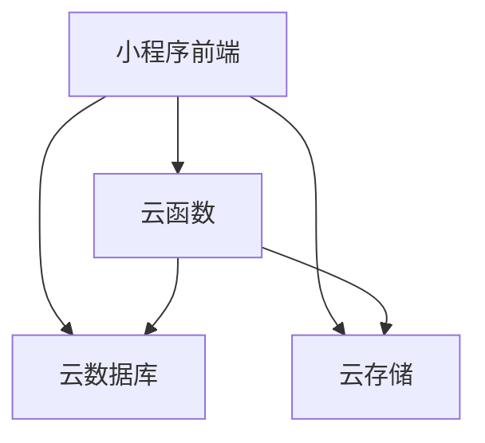
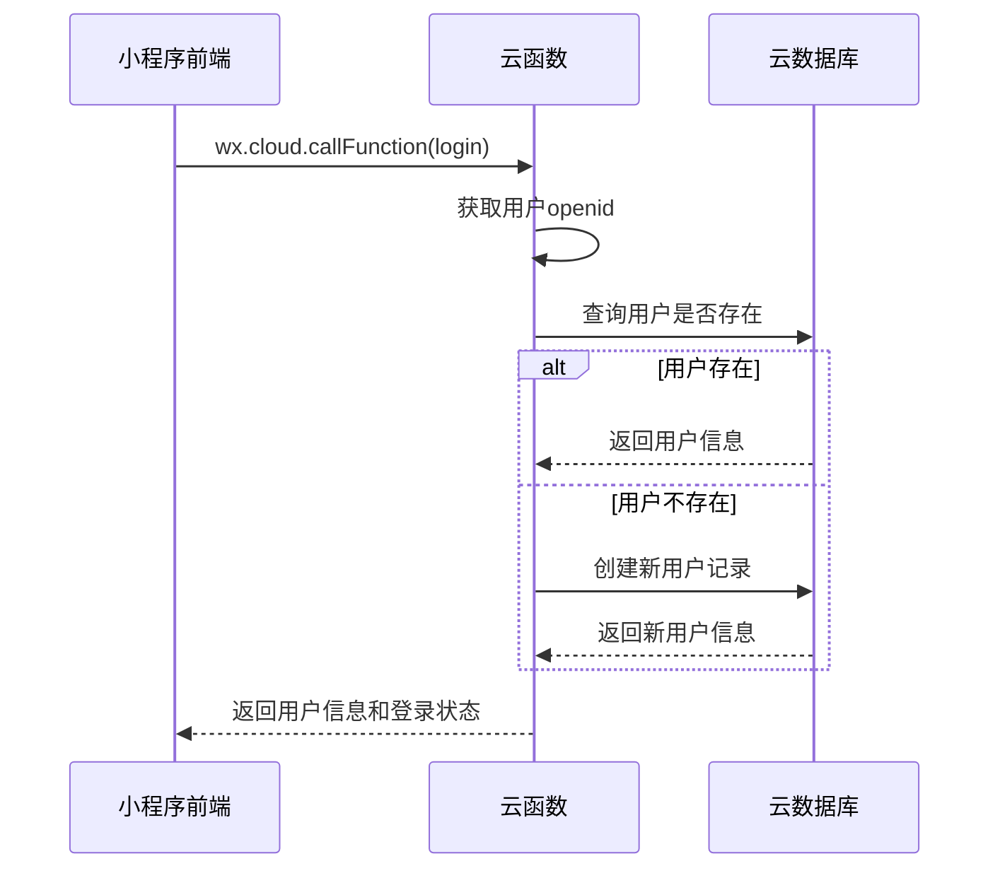
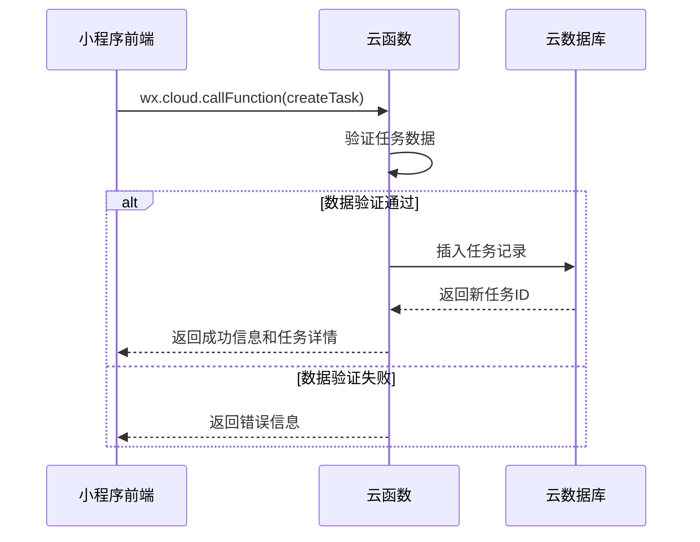
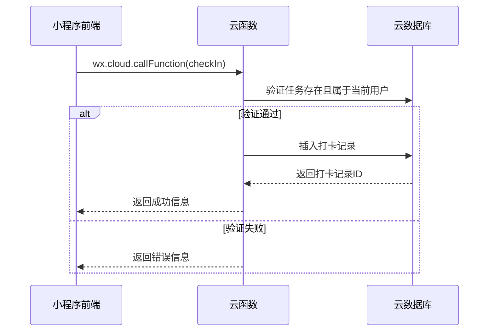

# 母婴打卡小程序 - 数据存储方案文档

## 1. 数据存储架构概述

### 1.1 整体架构

小程序采用云开发架构，数据存储主要基于云数据库，确保数据安全可靠，并支持多端同步访问。



### 1.2 技术选型

- **云数据库**: 微信小程序云开发提供的NoSQL数据库
- **云存储**: 微信小程序云开发提供的文件存储服务
- **云函数**: 微信小程序云开发提供的无服务器函数计算服务

## 2. 数据库设计

### 2.1 数据库集合设计

#### 2.1.1 `users` 集合 - 用户信息

**功能描述**: 存储用户基本信息和设置

**字段设计**:

| 字段名 | 数据类型 | 描述 | 是否必填 | 默认值 | 索引 |
|-------|---------|------|----------|-------|------|
| `_id` | String | 用户唯一ID（微信openid） | 是 | 无 | 主键 |
| `nickName` | String | 用户昵称 | 否 | 无 | 否 |
| `avatarUrl` | String | 用户头像URL | 否 | 无 | 否 |
| `gender` | Number | 用户性别（0:未知，1:男，2:女） | 否 | 0 | 否 |
| `createdAt` | Date | 创建时间 | 是 | Date.now() | 否 |
| `updatedAt` | Date | 更新时间 | 是 | Date.now() | 否 |
| `settings` | Object | 用户设置项 | 否 | {} | 否 |

**示例文档**:
```javascript
{
  _id: "openid_123456",
  nickName: "可爱妈妈",
  avatarUrl: "https://thirdwx.qlogo.cn/xxx",
  gender: 2,
  createdAt: ISODate("2023-06-15T08:30:00Z"),
  updatedAt: ISODate("2023-06-15T08:30:00Z"),
  settings: {
    theme: "light",
    notificationEnabled: true
  }
}
```

#### 2.1.2 `tasks` 集合 - 打卡任务

**功能描述**: 存储用户创建的打卡任务信息

**字段设计**:

| 字段名 | 数据类型 | 描述 | 是否必填 | 默认值 | 索引 |
|-------|---------|------|----------|-------|------|
| `_id` | String | 任务ID | 是 | 自动生成 | 主键 |
| `userId` | String | 所属用户ID | 是 | 无 | 是 |
| `name` | String | 任务名称 | 是 | 无 | 否 |
| `subtitle` | String | 任务副标题 | 否 | "" | 否 |
| `cycleType` | String | 循环类型（none:不循环, daily:每天, weekly:每周, monthly:每月） | 是 | "none" | 否 |
| `cycleConfig` | Object | 循环配置 | 否 | {} | 否 |
| `dailyTimes` | Number | 每天重复次数（仅当cycleType为daily时有效） | 否 | 1 | 否 |
| `status` | String | 任务状态（active:激活, archived:已归档, deleted:已删除） | 是 | "active" | 否 |
| `createdAt` | Date | 创建时间 | 是 | Date.now() | 否 |
| `updatedAt` | Date | 更新时间 | 是 | Date.now() | 否 |
| `isTemplate` | Boolean | 是否为模板任务 | 否 | false | 否 |

**循环配置详情**:

- **当 cycleType = "weekly"**:
  ```javascript
  cycleConfig: {
    daysOfWeek: [1, 3, 5] // 1-7，对应周一到周日，例如[1,3,5]表示周一、三、五
  }
  ```

- **当 cycleType = "monthly"**:
  ```javascript
  cycleConfig: {
    daysOfMonth: [1, 15] // 1-31，表示每月的哪几天
  }
  ```

**示例文档**:
```javascript
{
  _id: "task_123456",
  userId: "openid_123456",
  name: "宝宝每日喂奶",
  subtitle: "记录宝宝每天吃奶情况",
  cycleType: "daily",
  cycleConfig: {},
  dailyTimes: 3,
  status: "active",
  createdAt: ISODate("2023-06-15T08:30:00Z"),
  updatedAt: ISODate("2023-06-15T08:30:00Z"),
  isTemplate: false
}
```

#### 2.1.3 `check_records` 集合 - 打卡记录

**功能描述**: 存储用户的打卡记录

**字段设计**:

| 字段名 | 数据类型 | 描述 | 是否必填 | 默认值 | 索引 |
|-------|---------|------|----------|-------|------|
| `_id` | String | 记录ID | 是 | 自动生成 | 主键 |
| `userId` | String | 所属用户ID | 是 | 无 | 是 |
| `taskId` | String | 关联任务ID | 是 | 无 | 是 |
| `checkTime` | Date | 打卡时间 | 是 | Date.now() | 是 |
| `remark` | String | 打卡备注 | 否 | "" | 否 |
| `createdAt` | Date | 创建时间 | 是 | Date.now() | 否 |

**示例文档**:
```javascript
{
  _id: "record_123456",
  userId: "openid_123456",
  taskId: "task_123456",
  checkTime: ISODate("2023-06-15T09:30:00Z"),
  remark: "喝了120ml",
  createdAt: ISODate("2023-06-15T09:30:00Z")
}
```

#### 2.1.4 `task_templates` 集合 - 任务模板

**功能描述**: 存储预设的打卡任务模板

**字段设计**:

| 字段名 | 数据类型 | 描述 | 是否必填 | 默认值 | 索引 |
|-------|---------|------|----------|-------|------|
| `_id` | String | 模板ID | 是 | 自动生成 | 主键 |
| `category` | String | 模板分类 | 是 | 无 | 是 |
| `name` | String | 任务名称 | 是 | 无 | 否 |
| `subtitle` | String | 任务副标题 | 否 | "" | 否 |
| `cycleType` | String | 推荐循环类型 | 是 | "daily" | 否 |
| `cycleConfig` | Object | 推荐循环配置 | 否 | {} | 否 |
| `dailyTimes` | Number | 推荐每日次数 | 否 | 1 | 否 |
| `iconUrl` | String | 任务图标URL | 否 | "" | 否 |
| `description` | String | 任务描述 | 否 | "" | 否 |
| `createdAt` | Date | 创建时间 | 是 | Date.now() | 否 |
| `updatedAt` | Date | 更新时间 | 是 | Date.now() | 否 |

**示例文档**:
```javascript
{
  _id: "template_123456",
  category: "feeding",
  name: "宝宝每日喂奶",
  subtitle: "记录宝宝每天吃奶情况",
  cycleType: "daily",
  cycleConfig: {},
  dailyTimes: 3,
  iconUrl: "cloud://xxx/icon_feeding.png",
  description: "建议记录宝宝每次吃奶的时间和奶量，有助于掌握宝宝的喂养规律。",
  createdAt: ISODate("2023-06-15T08:30:00Z"),
  updatedAt: ISODate("2023-06-15T08:30:00Z")
}
```

### 2.2 索引设计

为了提高查询性能，需要在以下字段上建立索引：

| 集合名 | 索引字段 | 索引类型 | 说明 |
|-------|---------|---------|------|
| `users` | `_id` | 主键索引 | 用户ID查询 |
| `tasks` | `userId` | 单字段索引 | 按用户查询任务 |
| `tasks` | `userId, status` | 复合索引 | 按用户和状态查询任务 |
| `check_records` | `userId` | 单字段索引 | 按用户查询打卡记录 |
| `check_records` | `taskId` | 单字段索引 | 按任务查询打卡记录 |
| `check_records` | `userId, checkTime` | 复合索引 | 查询用户在特定时间范围内的打卡记录 |
| `task_templates` | `category` | 单字段索引 | 按分类查询模板 |

## 3. 数据安全与权限控制

### 3.1 数据库权限设置

| 集合名 | 读取权限 | 写入权限 | 说明 |
|-------|---------|---------|------|
| `users` | `仅创建者可读写` | `仅创建者可读写` | 确保用户只能访问自己的数据 |
| `tasks` | `仅创建者可读写` | `仅创建者可读写` | 确保用户只能访问和修改自己的任务 |
| `check_records` | `仅创建者可读写` | `仅创建者可读写` | 确保用户只能访问自己的打卡记录 |
| `task_templates` | `所有人可读` | `仅管理员可写` | 模板可供所有用户查看，但只能由管理员更新 |

### 3.2 数据验证

在云函数中实现数据验证，确保数据的完整性和合法性：

1. **创建任务时**：
   - 验证任务名称非空
   - 验证循环类型合法性
   - 验证循环配置与循环类型匹配
   - 当循环类型为"daily"时，验证每日次数在合理范围内(1-10)

2. **打卡记录时**：
   - 验证关联任务存在且属于当前用户
   - 验证打卡时间合理性

3. **用户信息更新时**：
   - 验证用户信息格式正确性
   - 限制用户设置项的修改范围

### 3.3 数据备份策略

1. **自动备份**：
   - 启用云开发数据库的自动备份功能
   - 备份频率：每日一次
   - 保留时间：30天

2. **手动备份**：
   - 重要更新前手动导出数据
   - 定期（如每月）进行全量备份

## 4. 数据访问逻辑

### 4.1 主要数据操作流程

#### 4.1.1 用户登录流程



#### 4.1.2 创建任务流程



#### 4.1.3 打卡记录流程



### 4.2 关键查询逻辑

#### 4.2.1 获取待打卡事项

```javascript
// 云函数示例
async function getPendingTasks(userId, date) {
  const tasks = await db.collection('tasks')
    .where({
      userId: userId,
      status: 'active'
    })
    .get();
  
  // 根据任务的循环配置计算指定日期是否需要打卡
  // 并查询该日期内已打卡的记录，计算剩余待打卡次数
  const pendingTasks = await Promise.all(tasks.data.map(async task => {
    const shouldCheckToday = calculateShouldCheckToday(task, date);
    if (!shouldCheckToday) return null;
    
    const checkCount = await db.collection('check_records')
      .where({
        userId: userId,
        taskId: task._id,
        checkTime: db.command.gte(startOfDay).and(db.command.lte(endOfDay))
      })
      .count();
    
    const remainingCount = task.cycleType === 'daily' ? 
      Math.max(0, task.dailyTimes - checkCount.total) : 
      (checkCount.total > 0 ? 0 : 1);
      
    return remainingCount > 0 ? {
      ...task,
      remainingCount,
      checkedToday: checkCount.total > 0
    } : null;
  }));
  
  return pendingTasks.filter(task => task !== null);
}
```

#### 4.2.2 获取历史打卡记录

```javascript
// 云函数示例
async function getHistoryRecords(userId, startDate, endDate) {
  const records = await db.collection('check_records')
    .where({
      userId: userId,
      checkTime: db.command.gte(startDate).and(db.command.lte(endDate))
    })
    .orderBy('checkTime', 'desc')
    .get();
  
  // 获取关联的任务信息，丰富返回数据
  const taskIds = [...new Set(records.data.map(record => record.taskId))];
  const tasks = await db.collection('tasks')
    .where({
      _id: db.command.in(taskIds)
    })
    .get();
  
  // 构建任务ID到任务信息的映射
  const taskMap = {};
  tasks.data.forEach(task => {
    taskMap[task._id] = task;
  });
  
  // 合并任务信息到打卡记录
  return records.data.map(record => ({
    ...record,
    taskInfo: taskMap[record.taskId] || {}
  }));
}
```

## 5. 性能优化策略

### 5.1 查询优化

1. **合理使用索引**：为常用查询字段建立索引，避免全表扫描
2. **分页查询**：大数据量查询时使用分页，每次限制返回数量
3. **字段筛选**：只返回必要的字段，减少数据传输量
4. **避免深查询**：减少关联查询的复杂度，必要时进行数据冗余

### 5.2 数据缓存

1. **本地缓存**：
   - 使用`wx.setStorage`缓存不常变动的数据，如用户信息、任务模板等
   - 缓存有效期设置合理，避免数据过期

2. **云函数缓存**：
   - 对于热点数据，在云函数中使用内存缓存
   - 使用Redis缓存共享数据（可选，需额外配置）

### 5.3 数据更新优化

1. **批量操作**：
   - 对于多条记录的更新或删除，使用批量操作减少数据库交互
   - 使用事务确保数据一致性

2. **增量更新**：
   - 只更新变化的字段，避免全量更新
   - 使用`$set`操作符进行字段更新

## 6. 数据迁移与同步方案

### 6.1 小程序初始化数据

首次启动时，需要进行以下初始化操作：

1. **用户数据初始化**：
   - 检测用户是否首次登录
   - 若是首次登录，创建用户记录并设置默认值

2. **任务模板初始化**：
   - 检查是否需要更新任务模板
   - 若需要，从云端获取最新模板数据

### 6.2 数据同步机制

1. **实时同步**：
   - 关键数据操作（如打卡）通过云函数实时更新到云端
   - 使用云数据库的实时监听功能，保持多端数据同步

2. **离线操作**：
   - 对于可能的离线场景，使用本地存储记录操作日志
   - 网络恢复后自动同步到云端
   - 冲突解决策略：以云端数据为准，或根据时间戳判断优先级

### 6.3 数据导入/导出

提供用户数据的导入导出功能：

1. **数据导出**：
   - 用户可导出自己的任务和打卡记录为JSON或CSV格式
   - 通过云函数生成导出文件，并提供下载链接

2. **数据导入**：
   - 支持用户导入之前导出的数据
   - 导入时进行数据验证和冲突检测

## 7. 数据统计与分析

### 7.1 统计功能

1. **打卡统计**：
   - 日/周/月打卡完成率
   - 连续打卡天数
   - 各类任务完成情况对比

2. **使用统计**：
   - 用户活跃度统计
   - 功能使用频率统计
   - 任务模板使用情况统计

### 7.2 数据可视化

在"我的"页面提供简单的数据可视化展示：

1. **打卡日历**：直观显示每日打卡情况
2. **完成率图表**：展示近期任务完成情况
3. **任务统计卡片**：显示任务总数、今日完成数等关键指标

## 8. 扩展性设计

### 8.1 数据模型扩展

为了支持未来功能扩展，数据模型设计考虑了以下扩展性：

1. **任务类型扩展**：
   - 任务模型支持灵活的循环配置，可轻松扩展更多循环类型
   - 支持添加自定义字段（通过扩展字段）

2. **用户数据扩展**：
   - 用户设置对象可灵活添加新的设置项
   - 支持添加用户偏好设置等

### 8.2 功能扩展规划

1. **团队协作**：
   - 支持多用户共享任务和打卡记录
   - 可扩展团队角色和权限管理

2. **数据分析**：
   - 添加更多数据统计维度
   - 支持生成周报/月报等分析报告

3. **社交功能**：
   - 支持分享打卡成就
   - 添加好友互动和排行榜功能

## 9. 实施计划

### 9.1 开发阶段

1. **阶段一：基础数据结构搭建**
   - 创建数据库集合和索引
   - 实现基本的数据访问权限控制
   - 开发核心云函数

2. **阶段二：核心功能实现**
   - 实现用户登录和数据初始化
   - 实现任务创建和管理
   - 实现打卡记录和查询

3. **阶段三：优化和测试**
   - 性能优化和负载测试
   - 数据一致性验证
   - 用户体验优化

### 9.2 维护与更新

1. **定期数据检查**：
   - 监控数据库性能
   - 清理无效或过期数据

2. **备份与恢复演练**：
   - 定期测试数据备份有效性
   - 准备数据恢复方案

3. **安全审计**：
   - 定期检查数据访问日志
   - 评估和更新安全措施

## 10. 总结

本数据存储方案设计充分考虑了母婴打卡小程序的功能需求和性能要求，采用云开发架构确保数据安全可靠。通过合理的数据库设计和索引优化，可以保证小程序在各种场景下的流畅运行。同时，方案中也考虑了未来功能扩展的可能性，为后续的功能迭代奠定了基础。